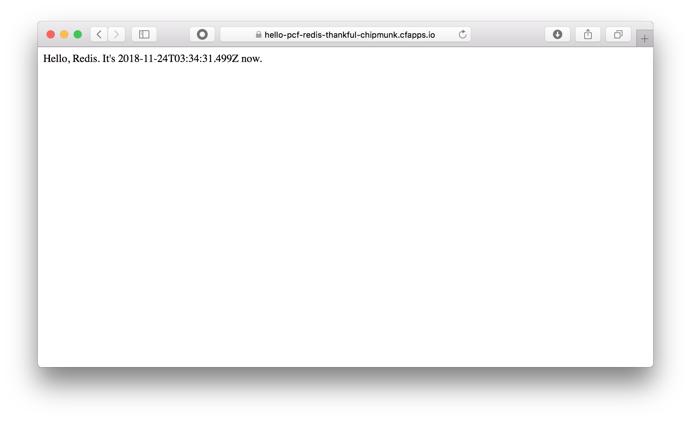

# バックエンドサービスの利用 - Redis
バックエンドサービスとして Redis を使用します。

## 概要 / 説明
Pivotal Cloud Foundry には、アプリケーションを強化、保護、管理するためのプラットフォーム・アドオンサービスをお客様に提供する仕組みとして、
**[Pivotal Services Marketplace](https://pivotal.io/jp/platform/services-marketplace)** が提供されています。
カタログされているサービスには、データ永続性、キャッシュ、メッセージング、継続的インテグレーションなど、多様な分野にわたり、
Pivotal、Pivotalのパートナー、Cloud Foundryコミュニティが提供する、精選されたアドオンサービスが掲載されています。

ここでは、データをキャッシュするために、**Redis** を使用します。

### Redis
Redis とはインメモリベースの Key/Value ストア (KVS) です。

保存したいデータ(値：value)に対し、対応する一意の標識(キー：key)を設定し、これらをペアで保存して使用します。

## 前提 / 環境
- [事前作業](https://github.com/shinyay/pcf-workshop-prerequisite/blob/master/README.md) 実施済み

## 手順 / 解説
### プロジェクトの作成
GitHub 上に作成済みの Spring Boot プロジェクトをクローン(`git clone`)しプロジェクトを作成します。

- https://github.com/shinyay/pcf-workshop-service-redis-code.git

任意のディレクトリで、以下のコマンドを実行します。

```
$ mkdir pcf-workshop
$ cd pcf-workshop
$ git clone https://github.com/shinyay/pcf-workshop-service-redis-code.git hello-pcf-redis
$ cd hello-pcf-redis
```

### アプリケーションの修正
クローンしたプロジェクトに含まれている次のソースコードを編集します。

- src/main/java/com/example/hellopcf/HelloPcfRedisApplication.java

#### 編集内容
- キャッシュ機能の有効化
  - `EnableCaching` アノテーションの追加
- キャッシュ対象のデータを生成する処理の作成
  - `Cacheable` アノテーションを追加したメソッドの作成と呼び出し
  
<details><summary>編集済みソースコード</summary>

```java
package com.example.hellopcf;

import org.springframework.boot.SpringApplication;
import org.springframework.boot.autoconfigure.SpringBootApplication;
import org.springframework.cache.annotation.Cacheable;
import org.springframework.cache.annotation.EnableCaching;
import org.springframework.stereotype.Component;
import org.springframework.web.bind.annotation.GetMapping;
import org.springframework.web.bind.annotation.RestController;

import java.time.OffsetDateTime;

@SpringBootApplication
@RestController
@EnableCaching
public class HelloPcfRedisApplication {
    private final Greeter greeter;

    public HelloPcfRedisApplication(Greeter greeter) {
        this.greeter = greeter;
    }

    @GetMapping("/")
    String hello() {
        return greeter.hello();
    }

    public static void main(String[] args) {
        SpringApplication.run(HelloPcfRedisApplication.class, args);
    }
}

@Component
class Greeter {
    @Cacheable("hello")
    public String hello() {
        return "Hello, Redis. It's " + OffsetDateTime.now() + " now.";
    }
}
```
</details>

### Pivotal Services Marketplace の利用
Pivotal Services Marketplace で提供されるサービスを使用します。

#### サービスの一覧
`cf marketplace` コマンドで利用可能なサービス一覧を表示します。

<details><summary>実行結果</summary>

```
syanagihara@pivotal.io として組織 syanagihara-org / スペース development 内のマーケットプレイスからサービスを取得しています...
OK

サービス                      プラン                                                                                                説明
Greenplum                     Free                                                                                                  Greenplum for Pivotal Cloud Foundry
app-autoscaler                standard                                                                                              Scales bound applications in response to load
blazemeter                    free-tier, basic1kmr*, pro5kmr*                                                                       Performance Testing Platform
cedexisopenmix                opx_global*, openmix-gslb-with-fusion-feeds*                                                          Openmix Global Cloud and Data Center Load Balancer
cleardb                       spark, boost*, amp*, shock*                                                                           Highly available MySQL for your Apps.
cloudamqp                     lemur, tiger*, bunny*, rabbit*, panda*                                                                Managed HA RabbitMQ servers in the cloud
cloudforge                    free, standard*, pro*                                                                                 Development Tools In The Cloud
elephantsql                   turtle, panda*, hippo*, elephant*                                                                     PostgreSQL as a Service
gluon                         free, indie*, business*, enterprise*                                                                  Mobile Synchronization and Cloud Integration
loadimpact                    lifree, li100*, li500*, li1000*                                                                       Performance testing for DevOps
memcachedcloud                100mb*, 250mb*, 500mb*, 1gb*, 2-5gb*, 5gb*, 30mb                                                      Enterprise-Class Memcached for Developers
memcachier                    dev, 100*, 250*, 500*, 1000*, 2000*, 5000*, 7500*, 10000*, 20000*, 50000*, 100000*                    The easiest, most advanced memcache.
metrics-forwarder             unlimited, 4x4000, 60x60000                                                                           Custom metrics service
mlab                          sandbox                                                                                               Fully managed MongoDB-as-a-Service
newrelic                      lite                                                                                                  Manage and monitor your apps
p-circuit-breaker-dashboard   standard*, trial                                                                                      Circuit Breaker Dashboard for Spring Cloud Applications
p-config-server               standard*, trial                                                                                      Config Server for Spring Cloud Applications
p-service-registry            standard*, trial                                                                                      Service Registry for Spring Cloud Applications
pubnub                        free                                                                                                  Build Realtime Apps that Scale
quotaguard                    starter, spike*, micro*, medium*, large*, enterprise*, premium*, deluxe*, super*, mega*, unlimited*   High Availability Enterprise-Ready Static IPs
rediscloud                    100mb*, 250mb*, 500mb*, 1gb*, 2-5gb*, 5gb*, 10gb*, 50gb*, 30mb                                        Enterprise-Class Redis for Developers
scheduler-for-pcf             standard                                                                                              Scheduler service
searchify                     small*, plus*, pro*                                                                                   Custom search you control
searchly                      small*, micro*, professional*, advanced*, starter, business*, enterprise*                             Search Made Simple. Powered-by Elasticsearch
sendgrid                      free, bronze*, silver*                                                                                Email Delivery. Simplified.
ssl                           basic*                                                                                                Upload your SSL certificate for your app(s) on your custom domain
stream                        free, starter*, growth*, pro*                                                                         Timelines, Build Scalable Newsfeeds & Activity Streams
streamdata                    spring, creek*, brook*                                                                                Future-proof your APIs !

* これらのサービス・プランには関連コストが伴います。 サービス・インスタンスを作成すると、このコストが発生します。

ヒント:  特定のサービスの個々のプランの説明を表示するには、'cf marketplace -s SERVICE' を使用します。
```
</details>

#### サービスの作成
Marketplace で提供されているサービスを使用するためには、これらサービスのインスタンスを作成する必要があります。
サービスインスタンスを作成するには、以下のコマンドを使用します。

```
$ cf create-service <サービス> <プラン> <インスタンス名>
```

今回は、Marketplace で提供されているインメモリKVS の **Redis** を使用します。
`cf marketplace` で一覧表示された中にある以下の `rediscloud` を作成します。

```
rediscloud                    100mb*, 250mb*, 500mb*, 1gb*, 2-5gb*, 5gb*, 10gb*, 50gb*, 30mb  
```

プランは 無償で使用できる `30mb` で作成します。
インスタンス名は、`hello-redis` とします。

```
$ cf create-service rediscloud 30mb hello-redis

syanagihara@pivotal.io としてサービス・インスタンス hello-redis を組織 syanagihara-org / スペース development 内に作成しています...
OK
```

作成したサービスインスタンスは、`cf services` コマンドで一覧表示ができます。

```
$ cf services

syanagihara@pivotal.io として組織 syanagihara-org / スペース development 内のサービスを取得しています...

名前          サービス     プラン   バインド済みアプリ   最後の操作
hello-redis   rediscloud   30mb                          create succeeded
```

この時点では、**バインド済みアプリ** の項目が空欄となっていて、アプリケーションとの関連付けができてない事が確認できます。

### サービスとアプリケーションのバインド
サービスインスタンスとアプリケーションを関連付けるためには、バインド処理(`cf bind-servic`) を実施する必要があります。

#### アプリケーションのデプロイ
Redis のサービスインスタンスとバインドする対象のアプリケーションをデプロイします。

まずアプリケーションのビルドを行います。
```
$ ./gradlew clean build -x test
```

続いてビルドできたアプリケーション `build/libs/hello-pcf-redis-0.0.1-SNAPSHOT.jar` を
デプロイと同時には起動しないように `--no-start` オプションをつけてデプロイを行います。

```
$ cf push hello-pcf-redis -p build/libs/hello-pcf-redis-0.0.1-SNAPSHOT.jar --random-route --no-start
```

<details><summary>実行結果</summary>

```
Pushing app hello-pcf-redis to org syanagihara-org / space development as syanagihara@pivotal.io...
Getting app info...
Creating app with these attributes...
+ 名前:       hello-pcf-redis
  path:       /Users/shinyay/works/workshop/pcf-workshop-service-redis/build/libs/hello-pcf-redis-0.0.1-SNAPSHOT.jar
  routes:
+   hello-pcf-redis-thankful-chipmunk.cfapps.io

Creating app hello-pcf-redis...
Mapping routes...
Comparing local files to remote cache...
Packaging files to upload...
Uploading files...
 281.03 KiB / 281.03 KiB [===============================================================================================================================================] 100.00% 2s

Waiting for API to complete processing files...

名前:                   hello-pcf-redis
要求された状態:         stopped
インスタンス:           0/1
使用:                   1G x 1 instances
routes:                 hello-pcf-redis-thankful-chipmunk.cfapps.io
最終アップロード日時:   Sat 24 Nov 12:22:37 JST 2018
スタック:               cflinuxfs2
ビルドパック:
start command:

このアプリの実行インスタンスはありません。
```
</details>

Redis のサービスインスタンス `hellp-redis` をバインドする対象のアプリケーション `hello-pcf-redis` がデプロイされました。

#### サービスのバインド
Redis のサービスインスタンス `hellp-redis` とアプリケーション `hello-pcf-redis` をバインドします。

サービスインスタンスをバインドするには、以下のコマンドを使用します。

```
$ cf bind-service <アプリケーション名> <インスタンス名>
```

<details><summary>実行結果</summary>

```
$ cf bind-service hello-pcf-redis hello-redis
Binding service hello-redis to app hello-pcf-redis in org syanagihara-org / space development as syanagihara@pivotal.io...
OK
ヒント: 確実に環境変数の変更が有効になるようにするには、'cf restage hello-pcf-redis' を使用します
```
</details>


#### サービスの環境情報
アプリケーションにバインドしたサービスは環境変数 `VCAP_SERVICES` に登録されます。
この情報を利用してアプリケーションはサービスインスタンスを使用します。

環境変数を確認するには、以下のコマンドを使用します。

```
$ cf env <アプリケーション名>
```

<details><summary>実行結果</summary>

```
$ cf env hello-pcf-redis

syanagihara@pivotal.io として組織 syanagihara-org / スペース development 内のアプリ hello-pcf-redis の環境変数を取得しています...
OK

システム提供:
{
 "VCAP_SERVICES": {
  "rediscloud": [
   {
    "binding_name": null,
    "credentials": {
     "hostname": "redis-15459.c98.us-east-1-4.ec2.cloud.redislabs.com",
     "password": "6xEKO0unHtC8v6zq55vQjWG2qMo13qPP",
     "port": "15459"
    },
    "instance_name": "hello-redis",
    "label": "rediscloud",
    "name": "hello-redis",
    "plan": "30mb",
    "provider": null,
    "syslog_drain_url": null,
    "tags": [
     "Data Stores",
     "Web-based",
     "Data Store",
     "Caching",
     "Messaging and Queuing",
     "Data Management",
     "key-value",
     "IT Management",
     "caching",
     "redis"
    ],
    "volume_mounts": []
   }
  ]
 }
}

{
 "VCAP_APPLICATION": {
  "application_id": "35db840d-998c-46d9-b18e-11b024f157bf",
  "application_name": "hello-pcf-redis",
  "application_uris": [
   "hello-pcf-redis-thankful-chipmunk.cfapps.io"
  ],
  "application_version": "65b50386-ad0c-41bd-8067-88c6535046cb",
  "cf_api": "https://api.run.pivotal.io",
  "limits": {
   "disk": 1024,
   "fds": 16384,
   "mem": 1024
  },
  "name": "hello-pcf-redis",
  "space_id": "73c92e17-2db8-46ff-bf76-4a9b7b9f307e",
  "space_name": "development",
  "uris": [
   "hello-pcf-redis-thankful-chipmunk.cfapps.io"
  ],
  "users": null,
  "version": "65b50386-ad0c-41bd-8067-88c6535046cb"
 }
}

ユーザー定義の環境変数が設定されていません

実行環境変数が設定されていません

ステージング中環境変数が設定されていません
```
</details>

#### アプリケーションの開始
アプリケーションにサービスインスタンスをバインドしましたが、`--no-start` オプションでデプロイしているので、まだ起動していません。
次に、アプリケーションを起動します。

```
$ cf start hello-pcf-redis
```

<details><summary>実行結果</summary>

```
syanagihara@pivotal.io として組織 syanagihara-org / スペース development 内のアプリ hello-pcf-redis を開始しています...

Staging app and tracing logs...
   Downloading app package...
   Downloaded app package (22.3M)
   -----> Java Buildpack v4.16.1 (offline) | https://github.com/cloudfoundry/java-buildpack.git#41b8ff8
   -----> Downloading Jvmkill Agent 1.16.0_RELEASE from https://java-buildpack.cloudfoundry.org/jvmkill/trusty/x86_64/jvmkill-1.16.0_RELEASE.so (found in cache)
   -----> Downloading Open Jdk JRE 1.8.0_192 from https://java-buildpack.cloudfoundry.org/openjdk/trusty/x86_64/openjdk-1.8.0_192.tar.gz (found in cache)
          Expanding Open Jdk JRE to .java-buildpack/open_jdk_jre (1.3s)
          JVM DNS caching disabled in lieu of BOSH DNS caching
   -----> Downloading Open JDK Like Memory Calculator 3.13.0_RELEASE from https://java-buildpack.cloudfoundry.org/memory-calculator/trusty/x86_64/memory-calculator-3.13.0_RELEASE.tar.gz (found in cache)
          Loaded Classes: 15489, Threads: 250
   -----> Downloading Client Certificate Mapper 1.8.0_RELEASE from https://java-buildpack.cloudfoundry.org/client-certificate-mapper/client-certificate-mapper-1.8.0_RELEASE.jar (found in cache)
   -----> Downloading Container Security Provider 1.16.0_RELEASE from https://java-buildpack.cloudfoundry.org/container-security-provider/container-security-provider-1.16.0_RELEASE.jar (found in cache)
   -----> Downloading Spring Auto Reconfiguration 2.5.0_RELEASE from https://java-buildpack.cloudfoundry.org/auto-reconfiguration/auto-reconfiguration-2.5.0_RELEASE.jar (found in cache)
   Exit status 0
   Uploading droplet, build artifacts cache...
   Uploading droplet...
   Uploading build artifacts cache...
   Uploaded build artifacts cache (129B)
   Uploaded droplet (69M)
   Uploading complete
   Cell d541eb10-3521-4536-b355-44cf16cb9031 stopping instance 49fa36ed-f85d-4e05-9a25-0b95d3a938f3
   Cell d541eb10-3521-4536-b355-44cf16cb9031 destroying container for instance 49fa36ed-f85d-4e05-9a25-0b95d3a938f3
   Cell d541eb10-3521-4536-b355-44cf16cb9031 successfully destroyed container for instance 49fa36ed-f85d-4e05-9a25-0b95d3a938f3

Waiting for app to start...

名前:                   hello-pcf-redis
要求された状態:         started
インスタンス:           1/1
使用:                   1G x 1 instances
routes:                 hello-pcf-redis-thankful-chipmunk.cfapps.io
最終アップロード日時:   Sat 24 Nov 12:22:37 JST 2018
スタック:               cflinuxfs2
ビルドパック:           client-certificate-mapper=1.8.0_RELEASE container-security-provider=1.16.0_RELEASE
                        java-buildpack=v4.16.1-offline-https://github.com/cloudfoundry/java-buildpack.git#41b8ff8 java-main java-opts java-security
                        jvmkill-agent=1.16.0_RELEASE open-jd...
start command:          JAVA_OPTS="-agentpath:$PWD/.java-buildpack/open_jdk_jre/bin/jvmkill-1.16.0_RELEASE=printHeapHistogram=1 -Djava.io.tmpdir=$TMPDIR
                        -Djava.ext.dirs=$PWD/.java-buildpack/container_security_provider:$PWD/.java-buildpack/open_jdk_jre/lib/ext
                        -Djava.security.properties=$PWD/.java-buildpack/java_security/java.security $JAVA_OPTS" &&
                        CALCULATED_MEMORY=$($PWD/.java-buildpack/open_jdk_jre/bin/java-buildpack-memory-calculator-3.13.0_RELEASE -totMemory=$MEMORY_LIMIT -loadedClasses=16268
                        -poolType=metaspace -stackThreads=250 -vmOptions="$JAVA_OPTS") && echo JVM Memory Configuration: $CALCULATED_MEMORY && JAVA_OPTS="$JAVA_OPTS
                        $CALCULATED_MEMORY" && MALLOC_ARENA_MAX=2 SERVER_PORT=$PORT eval exec $PWD/.java-buildpack/open_jdk_jre/bin/java $JAVA_OPTS -cp $PWD/.
                        org.springframework.boot.loader.JarLauncher

     状態   開始日時               CPU    メモリー       ディスク       詳細
#0   実行   2018-11-24T03:32:26Z   0.0%   130.6M of 1G   150.5M of 1G
```
</details>

### アプリケーションの動作確認




#### ブラウザからの確認

#### ログからの確認

```
$ cf logs hello-pcf-redis --recent
```

<details><summary>実行結果</summary>

```
Retrieving logs for app hello-pcf-redis in org syanagihara-org / space development as syanagihara@pivotal.io...

   2018-11-24T12:22:32.53+0900 [API/15] OUT Created app with guid 35db840d-998c-46d9-b18e-11b024f157bf
   2018-11-24T12:22:37.26+0900 [API/9] OUT Uploading bits for app with guid 35db840d-998c-46d9-b18e-11b024f157bf
   2018-11-24T12:31:46.64+0900 [API/4] OUT Creating build for app with guid 35db840d-998c-46d9-b18e-11b024f157bf
   2018-11-24T12:31:47.67+0900 [API/4] OUT Updated app with guid 35db840d-998c-46d9-b18e-11b024f157bf ({"state"=>"STARTED"})
   2018-11-24T12:31:47.84+0900 [STG/0] OUT Downloading dotnet_core_buildpack_beta...
   2018-11-24T12:31:47.84+0900 [STG/0] OUT Downloading java_buildpack...
   2018-11-24T12:31:47.84+0900 [STG/0] OUT Downloading dotnet_core_buildpack...
   2018-11-24T12:31:47.84+0900 [STG/0] OUT Downloading python_buildpack...
   2018-11-24T12:31:47.84+0900 [STG/0] OUT Downloading php_buildpack...
   2018-11-24T12:31:47.88+0900 [STG/0] OUT Downloaded php_buildpack
   2018-11-24T12:31:47.88+0900 [STG/0] OUT Downloading nodejs_buildpack...
   2018-11-24T12:31:47.88+0900 [STG/0] OUT Downloaded python_buildpack
   2018-11-24T12:31:47.88+0900 [STG/0] OUT Downloading go_buildpack...
   2018-11-24T12:31:47.89+0900 [STG/0] OUT Downloaded dotnet_core_buildpack
   2018-11-24T12:31:47.89+0900 [STG/0] OUT Downloading ruby_buildpack...
   2018-11-24T12:31:47.90+0900 [STG/0] OUT Downloaded java_buildpack
   2018-11-24T12:31:47.90+0900 [STG/0] OUT Downloaded dotnet_core_buildpack_beta
   2018-11-24T12:31:47.90+0900 [STG/0] OUT Downloading binary_buildpack...
   2018-11-24T12:31:47.91+0900 [STG/0] OUT Downloaded ruby_buildpack
   2018-11-24T12:31:47.91+0900 [STG/0] OUT Downloading staticfile_buildpack...
   2018-11-24T12:31:47.92+0900 [STG/0] OUT Downloaded binary_buildpack
   2018-11-24T12:31:47.95+0900 [STG/0] OUT Downloaded staticfile_buildpack
   2018-11-24T12:31:47.97+0900 [STG/0] OUT Downloaded nodejs_buildpack
   2018-11-24T12:31:48.46+0900 [STG/0] OUT Downloaded go_buildpack
   2018-11-24T12:31:48.46+0900 [STG/0] OUT Cell d541eb10-3521-4536-b355-44cf16cb9031 creating container for instance 49fa36ed-f85d-4e05-9a25-0b95d3a938f3
   2018-11-24T12:31:48.96+0900 [STG/0] OUT Cell d541eb10-3521-4536-b355-44cf16cb9031 successfully created container for instance 49fa36ed-f85d-4e05-9a25-0b95d3a938f3
   2018-11-24T12:31:49.21+0900 [STG/0] OUT Downloading app package...
   2018-11-24T12:31:50.43+0900 [STG/0] OUT Downloaded app package (22.3M)
   2018-11-24T12:31:52.69+0900 [STG/0] OUT -----> Java Buildpack v4.16.1 (offline) | https://github.com/cloudfoundry/java-buildpack.git#41b8ff8
   2018-11-24T12:31:52.76+0900 [STG/0] OUT -----> Downloading Jvmkill Agent 1.16.0_RELEASE from https://java-buildpack.cloudfoundry.org/jvmkill/trusty/x86_64/jvmkill-1.16.0_RELEASE.so (found in cache)
   2018-11-24T12:31:52.76+0900 [STG/0] OUT -----> Downloading Open Jdk JRE 1.8.0_192 from https://java-buildpack.cloudfoundry.org/openjdk/trusty/x86_64/openjdk-1.8.0_192.tar.gz (found in cache)
   2018-11-24T12:31:54.09+0900 [STG/0] OUT        Expanding Open Jdk JRE to .java-buildpack/open_jdk_jre (1.3s)
   2018-11-24T12:31:54.09+0900 [STG/0] OUT        JVM DNS caching disabled in lieu of BOSH DNS caching
   2018-11-24T12:31:54.09+0900 [STG/0] OUT -----> Downloading Open JDK Like Memory Calculator 3.13.0_RELEASE from https://java-buildpack.cloudfoundry.org/memory-calculator/trusty/x86_64/memory-calculator-3.13.0_RELEASE.tar.gz (found in cache)
   2018-11-24T12:31:55.06+0900 [STG/0] OUT        Loaded Classes: 15489, Threads: 250
   2018-11-24T12:31:55.08+0900 [STG/0] OUT -----> Downloading Client Certificate Mapper 1.8.0_RELEASE from https://java-buildpack.cloudfoundry.org/client-certificate-mapper/client-certificate-mapper-1.8.0_RELEASE.jar (found in cache)
   2018-11-24T12:31:55.08+0900 [STG/0] OUT -----> Downloading Container Security Provider 1.16.0_RELEASE from https://java-buildpack.cloudfoundry.org/container-security-provider/container-security-provider-1.16.0_RELEASE.jar (found in cache)
   2018-11-24T12:31:55.08+0900 [STG/0] OUT -----> Downloading Spring Auto Reconfiguration 2.5.0_RELEASE from https://java-buildpack.cloudfoundry.org/auto-reconfiguration/auto-reconfiguration-2.5.0_RELEASE.jar (found in cache)
   2018-11-24T12:32:05.84+0900 [STG/0] OUT Exit status 0
   2018-11-24T12:32:05.84+0900 [STG/0] OUT Uploading droplet, build artifacts cache...
   2018-11-24T12:32:05.84+0900 [STG/0] OUT Uploading droplet...
   2018-11-24T12:32:05.85+0900 [STG/0] OUT Uploading build artifacts cache...
   2018-11-24T12:32:05.90+0900 [STG/0] OUT Uploaded build artifacts cache (129B)
   2018-11-24T12:32:06.90+0900 [API/15] OUT Creating droplet for app with guid 35db840d-998c-46d9-b18e-11b024f157bf
   2018-11-24T12:32:11.09+0900 [STG/0] OUT Uploaded droplet (69M)
   2018-11-24T12:32:11.11+0900 [STG/0] OUT Uploading complete
   2018-11-24T12:32:11.61+0900 [STG/0] OUT Cell d541eb10-3521-4536-b355-44cf16cb9031 stopping instance 49fa36ed-f85d-4e05-9a25-0b95d3a938f3
   2018-11-24T12:32:11.61+0900 [STG/0] OUT Cell d541eb10-3521-4536-b355-44cf16cb9031 destroying container for instance 49fa36ed-f85d-4e05-9a25-0b95d3a938f3
   2018-11-24T12:32:12.06+0900 [CELL/0] OUT Cell e222f891-b602-4a15-9b26-fd45771f60ad creating container for instance b039ec15-55e0-47eb-55da-e2ee
   2018-11-24T12:32:12.52+0900 [CELL/0] OUT Cell e222f891-b602-4a15-9b26-fd45771f60ad successfully created container for instance b039ec15-55e0-47eb-55da-e2ee
   2018-11-24T12:32:13.79+0900 [STG/0] OUT Cell d541eb10-3521-4536-b355-44cf16cb9031 successfully destroyed container for instance 49fa36ed-f85d-4e05-9a25-0b95d3a938f3
   2018-11-24T12:32:16.44+0900 [CELL/0] OUT Starting health monitoring of container
   2018-11-24T12:32:16.62+0900 [APP/PROC/WEB/0] OUT JVM Memory Configuration: -Xmx430761K -Xss1M -XX:ReservedCodeCacheSize=240M -XX:MaxDirectMemorySize=10M -XX:MaxMetaspaceSize=105814K
   2018-11-24T12:32:18.63+0900 [APP/PROC/WEB/0] OUT   .   ____          _            __ _ _
   2018-11-24T12:32:18.63+0900 [APP/PROC/WEB/0] OUT  /\\ / ___'_ __ _ _(_)_ __  __ _ \ \ \ \
   2018-11-24T12:32:18.63+0900 [APP/PROC/WEB/0] OUT ( ( )\___ | '_ | '_| | '_ \/ _` | \ \ \ \
   2018-11-24T12:32:18.63+0900 [APP/PROC/WEB/0] OUT  \\/  ___)| |_)| | | | | || (_| |  ) ) ) )
   2018-11-24T12:32:18.63+0900 [APP/PROC/WEB/0] OUT   '  |____| .__|_| |_|_| |_\__, | / / / /
   2018-11-24T12:32:18.63+0900 [APP/PROC/WEB/0] OUT  =========|_|==============|___/=/_/_/_/
   2018-11-24T12:32:18.63+0900 [APP/PROC/WEB/0] OUT  :: Spring Boot ::        (v2.1.0.RELEASE)
   2018-11-24T12:32:19.25+0900 [APP/PROC/WEB/0] OUT 2018-11-24 03:32:19.254  INFO 18 --- [           main] pertySourceApplicationContextInitializer : 'cloud' property source added
   2018-11-24T12:32:19.26+0900 [APP/PROC/WEB/0] OUT 2018-11-24 03:32:19.260  INFO 18 --- [           main] nfigurationApplicationContextInitializer : Reconfiguration enabled
   2018-11-24T12:32:19.27+0900 [APP/PROC/WEB/0] OUT 2018-11-24 03:32:19.271  INFO 18 --- [           main] c.e.hellopcf.HelloPcfRedisApplication    : Starting HelloPcfRedisApplication on b039ec15-55e0-47eb-55da-e2ee with PID 18 (/home/vcap/app/BOOT-INF/classes started by vcap in /home/vcap/app)
   2018-11-24T12:32:19.27+0900 [APP/PROC/WEB/0] OUT 2018-11-24 03:32:19.272  INFO 18 --- [           main] c.e.hellopcf.HelloPcfRedisApplication    : The following profiles are active: cloud
   2018-11-24T12:32:20.83+0900 [APP/PROC/WEB/0] OUT 2018-11-24 03:32:20.830  INFO 18 --- [           main] .s.d.r.c.RepositoryConfigurationDelegate : Multiple Spring Data modules found, entering strict repository configuration mode!
   2018-11-24T12:32:20.83+0900 [APP/PROC/WEB/0] OUT 2018-11-24 03:32:20.835  INFO 18 --- [           main] .s.d.r.c.RepositoryConfigurationDelegate : Bootstrapping Spring Data repositories in DEFAULT mode.
   2018-11-24T12:32:20.89+0900 [APP/PROC/WEB/0] OUT 2018-11-24 03:32:20.891  INFO 18 --- [           main] .s.d.r.c.RepositoryConfigurationDelegate : Finished Spring Data repository scanning in 28ms. Found 0 repository interfaces.
   2018-11-24T12:32:21.92+0900 [APP/PROC/WEB/0] OUT 2018-11-24 03:32:21.924  INFO 18 --- [           main] o.c.reconfiguration.CloudServiceUtils    : 'redisConnectionFactory' bean of type with 'org.springframework.data.redis.connection.RedisConnectionFactory' reconfigured with 'hello-redis' bean
   2018-11-24T12:32:22.87+0900 [APP/PROC/WEB/0] OUT 2018-11-24 03:32:22.874  INFO 18 --- [           main] o.s.b.w.embedded.tomcat.TomcatWebServer  : Tomcat initialized with port(s): 8080 (http)
   2018-11-24T12:32:22.93+0900 [APP/PROC/WEB/0] OUT 2018-11-24 03:32:22.932  INFO 18 --- [           main] o.apache.catalina.core.StandardService   : Starting service [Tomcat]
   2018-11-24T12:32:22.93+0900 [APP/PROC/WEB/0] OUT 2018-11-24 03:32:22.933  INFO 18 --- [           main] org.apache.catalina.core.StandardEngine  : Starting Servlet Engine: Apache Tomcat/9.0.12
   2018-11-24T12:32:22.95+0900 [APP/PROC/WEB/0] OUT 2018-11-24 03:32:22.954  INFO 18 --- [           main] o.a.catalina.core.AprLifecycleListener   : The APR based Apache Tomcat Native library which allows optimal performance in production environments was not found on the java.library.path: [/usr/java/packages/lib/amd64:/usr/lib64:/lib64:/lib:/usr/lib]
   2018-11-24T12:32:23.18+0900 [APP/PROC/WEB/0] OUT 2018-11-24 03:32:23.184  INFO 18 --- [           main] o.a.c.c.C.[Tomcat].[localhost].[/]       : Initializing Spring embedded WebApplicationContext
   2018-11-24T12:32:23.18+0900 [APP/PROC/WEB/0] OUT 2018-11-24 03:32:23.184  INFO 18 --- [           main] o.s.web.context.ContextLoader            : Root WebApplicationContext: initialization completed in 3835 ms
   2018-11-24T12:32:23.93+0900 [APP/PROC/WEB/0] OUT 2018-11-24 03:32:23.934  INFO 18 --- [           main] o.s.b.w.servlet.FilterRegistrationBean   : Mapping filter: 'clientCertificateMapper' to: [/*]
   2018-11-24T12:32:23.93+0900 [APP/PROC/WEB/0] OUT 2018-11-24 03:32:23.934  INFO 18 --- [           main] o.s.b.w.servlet.FilterRegistrationBean   : Mapping filter: 'characterEncodingFilter' to: [/*]
   2018-11-24T12:32:23.93+0900 [APP/PROC/WEB/0] OUT 2018-11-24 03:32:23.934  INFO 18 --- [           main] o.s.b.w.servlet.FilterRegistrationBean   : Mapping filter: 'webMvcMetricsFilter' to: [/*]
   2018-11-24T12:32:23.93+0900 [APP/PROC/WEB/0] OUT 2018-11-24 03:32:23.935  INFO 18 --- [           main] o.s.b.w.servlet.FilterRegistrationBean   : Mapping filter: 'hiddenHttpMethodFilter' to: [/*]
   2018-11-24T12:32:23.93+0900 [APP/PROC/WEB/0] OUT 2018-11-24 03:32:23.935  INFO 18 --- [           main] o.s.b.w.servlet.FilterRegistrationBean   : Mapping filter: 'formContentFilter' to: [/*]
   2018-11-24T12:32:23.93+0900 [APP/PROC/WEB/0] OUT 2018-11-24 03:32:23.935  INFO 18 --- [           main] o.s.b.w.servlet.FilterRegistrationBean   : Mapping filter: 'requestContextFilter' to: [/*]
   2018-11-24T12:32:23.93+0900 [APP/PROC/WEB/0] OUT 2018-11-24 03:32:23.935  INFO 18 --- [           main] o.s.b.w.servlet.FilterRegistrationBean   : Mapping filter: 'httpTraceFilter' to: [/*]
   2018-11-24T12:32:23.93+0900 [APP/PROC/WEB/0] OUT 2018-11-24 03:32:23.935  INFO 18 --- [           main] o.s.b.w.servlet.ServletRegistrationBean  : Servlet dispatcherServlet mapped to [/]
   2018-11-24T12:32:24.51+0900 [APP/PROC/WEB/0] OUT 2018-11-24 03:32:24.515  INFO 18 --- [           main] o.s.s.concurrent.ThreadPoolTaskExecutor  : Initializing ExecutorService 'applicationTaskExecutor'
   2018-11-24T12:32:25.30+0900 [APP/PROC/WEB/0] OUT 2018-11-24 03:32:25.304  INFO 18 --- [           main] o.s.b.a.e.web.EndpointLinksResolver      : Exposing 2 endpoint(s) beneath base path '/actuator'
   2018-11-24T12:32:25.41+0900 [APP/PROC/WEB/0] OUT 2018-11-24 03:32:25.412  INFO 18 --- [           main] o.s.b.w.embedded.tomcat.TomcatWebServer  : Tomcat started on port(s): 8080 (http) with context path ''
   2018-11-24T12:32:25.41+0900 [APP/PROC/WEB/0] OUT 2018-11-24 03:32:25.416  INFO 18 --- [           main] c.e.hellopcf.HelloPcfRedisApplication    : Started HelloPcfRedisApplication in 7.561 seconds (JVM running for 8.785)
   2018-11-24T12:32:26.85+0900 [CELL/0] OUT Container became healthy
   2018-11-24T12:34:30.98+0900 [APP/PROC/WEB/0] OUT 2018-11-24 03:34:30.987  INFO 18 --- [nio-8080-exec-7] o.a.c.c.C.[Tomcat].[localhost].[/]       : Initializing Spring DispatcherServlet 'dispatcherServlet'
   2018-11-24T12:34:30.98+0900 [APP/PROC/WEB/0] OUT 2018-11-24 03:34:30.988  INFO 18 --- [nio-8080-exec-7] o.s.web.servlet.DispatcherServlet        : Initializing Servlet 'dispatcherServlet'
   2018-11-24T12:34:31.00+0900 [APP/PROC/WEB/0] OUT 2018-11-24 03:34:31.009  INFO 18 --- [nio-8080-exec-7] o.s.web.servlet.DispatcherServlet        : Completed initialization in 21 ms
   2018-11-24T12:34:31.23+0900 [APP/PROC/WEB/0] OUT 2018-11-24 03:34:31.236  INFO 18 --- [nio-8080-exec-7] io.lettuce.core.EpollProvider            : Starting without optional epoll library
   2018-11-24T12:34:31.23+0900 [APP/PROC/WEB/0] OUT 2018-11-24 03:34:31.238  INFO 18 --- [nio-8080-exec-7] io.lettuce.core.KqueueProvider           : Starting without optional kqueue library
   2018-11-24T12:34:31.53+0900 [RTR/0] OUT hello-pcf-redis-thankful-chipmunk.cfapps.io - [2018-11-24T03:34:30.942+0000] "GET / HTTP/1.1" 200 0 48 "-" "Mozilla/5.0 (Macintosh; Intel Mac OS X 10_13_6) AppleWebKit/605.1.15 (KHTML, like Gecko) Version/12.0.1 Safari/605.1.15" "10.10.2.71:8346" "10.10.149.165:61124" x_forwarded_for:"111.239.168.67, 10.10.2.71" x_forwarded_proto:"https" vcap_request_id:"61e0c96e-9acf-4975-4154-94c47a328803" response_time:0.593376048 app_id:"35db840d-998c-46d9-b18e-11b024f157bf" app_index:"0" x_b3_traceid:"e35c95773c6ffe6f" x_b3_spanid:"e35c95773c6ffe6f" x_b3_parentspanid:"-"
   2018-11-24T12:34:31.53+0900 [RTR/0] OUT
   2018-11-24T12:34:32.90+0900 [RTR/10] OUT hello-pcf-redis-thankful-chipmunk.cfapps.io - [2018-11-24T03:34:32.877+0000] "GET /favicon.ico HTTP/1.1" 200 0 946 "https://hello-pcf-redis-thankful-chipmunk.cfapps.io/" "Mozilla/5.0 (Macintosh; Intel Mac OS X 10_13_6) AppleWebKit/605.1.15 (KHTML, like Gecko) Version/12.0.1 Safari/605.1.15" "10.10.66.135:47460" "10.10.149.165:61124" x_forwarded_for:"111.239.168.67, 10.10.66.135" x_forwarded_proto:"https" vcap_request_id:"cdbf5556-c461-495b-63a1-61dd88e115c8" response_time:0.025482728 app_id:"35db840d-998c-46d9-b18e-11b024f157bf" app_index:"0" x_b3_traceid:"7360cf760f646b9d" x_b3_spanid:"7360cf760f646b9d" x_b3_parentspanid:"-"
   2018-11-24T12:34:32.90+0900 [RTR/10] OUT
   2018-11-24T12:34:36.76+0900 [RTR/8] OUT hello-pcf-redis-thankful-chipmunk.cfapps.io - [2018-11-24T03:34:36.733+0000] "GET / HTTP/1.1" 200 0 48 "-" "Mozilla/5.0 (Macintosh; Intel Mac OS X 10_13_6) AppleWebKit/605.1.15 (KHTML, like Gecko) Version/12.0.1 Safari/605.1.15" "10.10.2.71:6912" "10.10.149.165:61124" x_forwarded_for:"111.239.168.67, 10.10.2.71" x_forwarded_proto:"https" vcap_request_id:"d3e40a93-5770-4060-7a89-17828c87410c" response_time:0.027552935 app_id:"35db840d-998c-46d9-b18e-11b024f157bf" app_index:"0" x_b3_traceid:"a0a71bc95d1b7725" x_b3_spanid:"a0a71bc95d1b7725" x_b3_parentspanid:"-"
   2018-11-24T12:34:36.76+0900 [RTR/8] OUT
   2018-11-24T12:34:38.33+0900 [RTR/8] OUT hello-pcf-redis-thankful-chipmunk.cfapps.io - [2018-11-24T03:34:38.313+0000] "GET / HTTP/1.1" 200 0 48 "-" "Mozilla/5.0 (Macintosh; Intel Mac OS X 10_13_6) AppleWebKit/605.1.15 (KHTML, like Gecko) Version/12.0.1 Safari/605.1.15" "10.10.2.71:7070" "10.10.149.165:61124" x_forwarded_for:"111.239.168.67, 10.10.2.71" x_forwarded_proto:"https" vcap_request_id:"2fe248df-0718-4649-4ee9-ca11b5bd75ef" response_time:0.024882156 app_id:"35db840d-998c-46d9-b18e-11b024f157bf" app_index:"0" x_b3_traceid:"8d2d380c9ab98364" x_b3_spanid:"8d2d380c9ab98364" x_b3_parentspanid:"-"
   2018-11-24T12:34:38.33+0900 [RTR/8] OUT
   2018-11-24T12:34:39.69+0900 [RTR/6] OUT hello-pcf-redis-thankful-chipmunk.cfapps.io - [2018-11-24T03:34:39.672+0000] "GET / HTTP/1.1" 200 0 48 "-" "Mozilla/5.0 (Macintosh; Intel Mac OS X 10_13_6) AppleWebKit/605.1.15 (KHTML, like Gecko) Version/12.0.1 Safari/605.1.15" "10.10.2.71:54162" "10.10.149.165:61124" x_forwarded_for:"111.239.168.67, 10.10.2.71" x_forwarded_proto:"https" vcap_request_id:"1c69e712-9998-4f3f-6555-ed8054cb2603" response_time:0.019297638 app_id:"35db840d-998c-46d9-b18e-11b024f157bf" app_index:"0" x_b3_traceid:"ed2d1cf1aeaf785e" x_b3_spanid:"ed2d1cf1aeaf785e" x_b3_parentspanid:"-"
   2018-11-24T12:34:39.69+0900 [RTR/6] OUT
```

## まとめ / 振り返り

### 今回のソース
- []()
